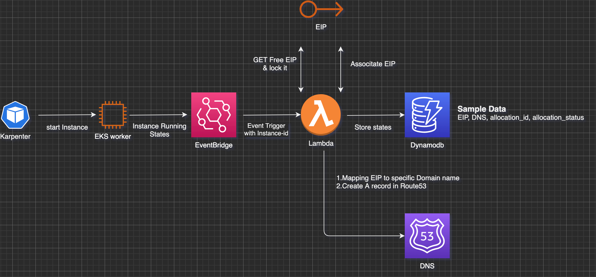

# karpenter-based-scaling-solution-for-Media-server

## Background

Bandwidth-intensive and latency-sensitive application need one Pod per kubernetes worker, and it will provide service directly via hostNetwork(EIP) rather than Ingress or LB. Therefore, this solution is aimed to provide  **auto-binding of EIP** to karpenter managed EKS worker, **auto-generation of related route53 DNS record**.

## Solution introduction

A straight forward way is to embed the script of EIP binding, DNS creation, record storage into user data of Karpenter worker template. Howerver, there are two consideratble shortages in this scenarios.

*  The IAM policy of worker is too much. Eg, EIP access, DDB access, route53 access and so on,
*  It is not elastic and couple everything into the intial script of AMI

Under that, a more secure and elatic solution is right there



* If there are any unschduled pods, Karpenter will launch groups of new EKS workers
* Evenbridge will listen on "Instance state change" notification
* Once the instance states comes to running, a lambda function will be trggered.
* Lambda will first get all unassociated EIP with specific tags. Then, assign EIP to the instance
* Secondly, lambda will create a DNS record based on specific mapping policy
* Finally, lambda will store EIP, DNS, associate_id and allocation status into Dynamodb. Then schedule server could utilize meeting server pool based on Dynamodb 

## How to deploy

We will provide  one-stop CDK solution in the furture. But for now, we need blow prerequesites

#### Steps

1. Create a Public Host-Zone on Route53
2. Create a Dynamodb Table called "record_table" with below design
    ```
        'partitionKey': {
            'S': EIP,
        },
        'sortkey': {
            'S': DNS_Record,
        },
        'AssociationId': {
            'S': AssociationId,
        },
        'allocated': {
            'BOOL': Status,
        },
    ```
* Eventbridge rule with patten like blow
  
  Event Pattern
  ```
  {
  "source": ["aws.ec2"],
  "detail-type": ["EC2 Instance State-change Notification"],
  "detail": {
    "state": ["running"]
   }
  }
  ```
  > ![Important] Tags of the instance will not be passed for now so that every instance run will trigger the rule, and the fileter work needed to be done in following lambda function

  Targets to the lambda function.

3. Upload lambda function 
   
   User could just upload main.py to lambda function with python3.8 or above.

   Also, adjust below enviroment parameters as required
   * execution role
     * policy to access ddb, route53, EIP
   * exectuion durarion
     * most of the work will be finished within 1minutes
  

   Please ensure adjust below parameter in main.py as your enviroments required
   * suffix = "sample.com"
   * hostZoneId = "samplehostid"


## Pending Actions
* PFR for AWS team to add tag content in detail{}.
* Alternative solution, replcae eventbridge with APIGateway so that embed only a http call into the user data to limit the invocations.
* CDK stack to provision the entire stacks.
  
  


